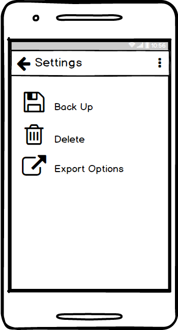

# Drake's Studio Timer App... name under construction 😬

This app should:

* Record the time of each studio session and be able to set a name and any other notes needed
* In each session, log times { something } took. ex: 

``` json
taskPerSession: {
	Tracking: 00:15:37;
	Editing: 00:23:42;
	whatever: remainingTime;
}
```

SessionTotalTime : 01:15:34

* Be able to sort through stored sessions and create expotrable logs that can be used as invoices

## Design idea

Main Page: 

Log Page:  

Export Page: 

Settings Page: 


Design: [react-native-material-design](https://github.com/react-native-material-design/react-native-material-design)